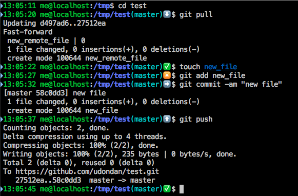

# Git Aware Prompt

Based on https://github.com/jimeh/git-aware-prompt

Adds symbols indicating git status:

- ✅  No local or remote changes
- ✴️  Unstaged changes
- ➡️  Uncommitted changes
- ⬆️  Local changes ready to be pushed
- ⬇️  New remote changes

## Preview

## Installation

    mkdir -p "$HOME/.bash"
    git clone https://github.com/udondan/git-aware-prompt "$HOME/.bash/git-aware-prompt"

Then in your `~/.bash_profile` add these lines:

    export GITAWAREPROMPT=~/.bash/git-aware-prompt
    source "${GITAWAREPROMPT}/main.sh"

And override `PS1` to look something like this including the vars `$git_branch` and `$git_dirty`

    PS1="\[\033[32m\]\t \u@\h\[\033[00m\]:\[\033[01;34m\]\w\[\033[00m\]\[$txtcyn\]\$git_branch\[$txtred\]\$git_dirty\[$txtrst\]\$ "
